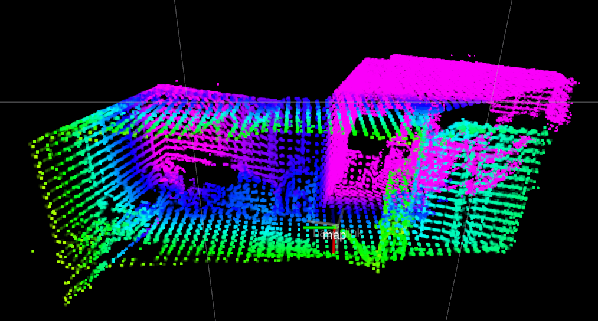
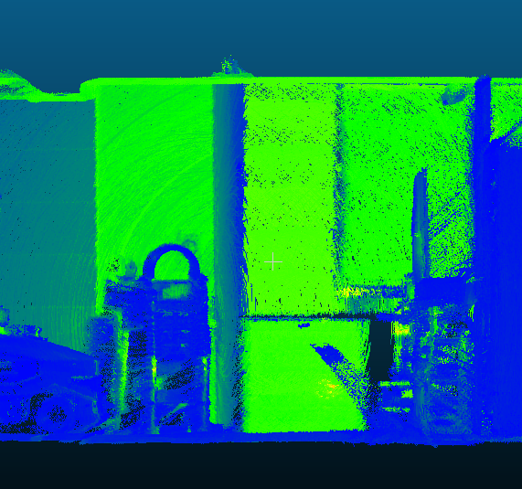

# extended_lidar_camera_calib

This work is an extended version of [livox_camera_calib](https://github.com/hku-mars/livox_camera_calib.git), which is suitable for spinning LiDAR。

In order to apply this algorithm on spinning LIDAR(e.g:VLP16)， I add the preprocess process([FLOAM](https://github.com/wh200720041/floam.git)) to make the point cloud of the spinning LiDAR denser.

## Data Prepare

When you calibrate the spinning lidar and camera, record the data by holding the device(lidar and camera) stationary for a period of time and then slowly and repeatedly move the entire device in this direction to accumulate the point cloud.

## Dependency
```
ceres-slover == 1.14.0
pcl==1.8.0
```

## Build
```
cd ~/catkin_ws/src
git clone https://github.com/AFEICHINA/extended_lidar_camera_calib.git
cd ..
catkin_make
source ~/catkin_ws/devel/setup.bash
```

## Run
step1: doing slam to accumulate dense pointcloud. 
```
roslaunch floam floam_XXX.launch
```


step2: lidar camera calibration
```
roslaunch livox_camera_calib calib_XXX.launch
```

## My Result
In my test, I get better results in indoor enviroment. 
```
LIDAR : Robosense RS-Bpearl
Camera: MindVision MV-SUA133GC-T
```
slam result:
<p align='center'>

</p>

map result:
<p align='center'>

</p>

calib result:
<p align='center'>

</p>

## Acknowledgements
Thanks for [livox_camera_calib](https://github.com/hku-mars/livox_camera_calib.git) and [FLOAM](https://github.com/wh200720041/floam.git).
